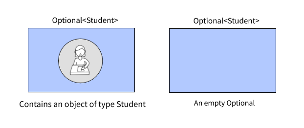

## Effective Use of Optionals in Java
### The Problems with `null` References

If you are a Java developer then you must have used `null` to denote as "the absence of a value". And it might not be
the case that you never got a `NullPointerException` (NPE) in any of your Java program. If you have written code in Java 8 or
later, then you might have known that Java has introduced `java.util.Optional<T>` as a better alternative to `null`. In
this article I'm going to explain what is `Optional` and how you can use it effectively. But before going too far, I
want you to think about the problems of using `null` and how `null` has created a useful(!) exception(
NPE) to a nightmare to all the existing Java developers.

I would like to mention the most common problems you may face while using `null` like the following:

1. `null` is meaningless. When an object refer to `null` reference, it indicates the absence of value. But it's hard to
   tell whether the value is actually empty (intentionally/logically) or not initialized yet or empty due to a bug in
   your algorithm/logic.
2. Unnecessarily null checking compromises readability by increasing nested indentations and code verbosity.
3. A generous(!) source of errors. As Java doesn't enforce null checking, so when you forget to check nullability of an
   object it may produce the annoying `NullPointerException`.
4. `null` carries no information about the intention of use - type information, if missing value is permitted or not
   etc.
5. and more...

Let's understand the problems by some code examples. Say, we have the following domains from an imaginary university
management system:

```java
public class Student {
  private String name;
  private Account account;
  // other fields, getters, and setters are omitted for simplicity
}

public class Account {
  private double balance;
  private Loan loan;
  // other fields, getters, and setters are omitted for simplicity
}

public class Loan {
  private double amount;
  // other fields, getters, and setters are omitted for simplicity
}
```

Now if you want to retrieve loan information of a student then you may write a method simply like this.

```java
public Double getLoanAmountOfStudent(Student student){
  return student.getAccount().getLoan().getAmount();
}
```

The problem with the code is that if any of the reference in the call is null then it will cause **train wreck** by
throwing the NPE. To solve this you may rewrite the method like below.

```java
public Double getLoanAmountOfStudent(Student student) {
    if (student != null) {
      if (student.getAccount() != null) {
        Account account = student.getAccount();
        if (account.getLoan() != null) {
          Loan loan = account.getLoan();
          if (loan.getAmount() != null) {
            return loan.getAmount();
          }
        }
      }
    }
    return 0d;
  }
```

Now this method has become hard to read because everytime you have a doubt on an object reference, you need to check the
nullability, if you miss one `null` check then it may produce `NulPointerException` exception. Another problem is with
the return type, by observing the returned value of the method you can't say whether the student does not have a loan or
the loan amount has become 0 (maybe paid off the loan already).

### Introduction to `Optional<T>`

Java 8 introduces a new class called java.util.Optional<T> that is inspired by Haskell and Scala. The class may contain
an optional value otherwise empty value. The intention of the Optional class isn’t to replace every single `null`
reference rather help you design comprehensible APIs, bring better readability, and obviously help to avoid
the NPE.

Using **Optionals** can bring the following benefits to your code:

1. Declaring a variable of type `Optional<T>` indicates that the variable of that type may contain missing value.
2. Enforces "null checking" by encapsulating the actual value
3. Can be used in functional way



### Creating Optional Objects

We can think of three types of values an Optional object can hold - **empty**, **nullable**, and **non-null**. Let's see
how you can create different types of Optionals using static factory methods of
`java.lang.Optional<T>`.

Empty Optional indicates absence of value and can be created like below -
```java
Optional.empty()
```

Nullable Optional indicates the value in it is permitted to be null and can be created like below -
```java
Optional.ofNullable(value)
```

Non-null Optional indicates the value in it is mandatory to be present and can be created like below -
```java
Optional.of(value)
```

### Code Example Using Optional
So, I think you have got enough about Optional and how to create an object of Optional. Let's redesign the above classes
using Optionals.

```java
  public class Student {
    private String name;
    private Account account;
    // other fields, getters, and setters are omitted for simplicity
  }

  public class Account {
    private Double balance;
    private Optional<Loan> loan;
    // other fields, getters, and setters are omitted for simplicity
  }

  public class Loan {
    private Double amount;
    // other fields, getters, and setters are omitted for simplicity
  }
```

You can see that I have only changed the `Loan` type to `Optional<Loan>` in the `Account` class. That is a clear indication
for a developer that an account may not have a loan against it, and it's planned that way. Other fields remain same as
earlier and indicates composition that means being pointing to `null` reference for these variables indicates either
missing data or bug in your code.

The designers of the `Optional` class developed it with the purpose to support the optional-return idiom only.
Thus `Optional` does not implement the `Serializable` interface and may break applications that need domains/classes to
be serialized. **That's why using **Optional** as a field type is an anti-pattern**.

> Optional is primarily intended for use as a method return type where there is a clear need to represent "no result,
> "and where using null is likely to cause errors. A variable whose type is Optional should never itself be null; 
> it should always point to an Optional instance. 
> [see at Java SE documentation](https://docs.oracle.com/en/java/javase/11/docs/api/java.base/java/util/Optional.html)

The problem could be solved by adding **Optional** to the return type of getters. Let's refactor the classes to avoid
the problem as well as having the benefits of using Optionals.

```java
public class Student {
   private String name;
   private Account account;

   public Optional<Account> getAccount() {
      return Optional.of(account);
   }
   // other fields, getters, and setters are omitted for simplicity
}

public class Account {
   private Double balance;
   private Loan loan;

   public Optional<Loan> getLoan() {
      return Optional.ofNullable(loan);
   }
   // other fields, getters, and setters are omitted for simplicity
}

public class Loan {
   private Double amount;
   // other fields, getters, and setters are omitted for simplicity
}
```
Now let's rewrite the `getLoanAmountOfStudent` method using `Optional` with the updated domains.

```java
  public Double getLoanAmountOfStudent(Student student) {
    Optional<Student> opStudent = Optional.ofNullable(student);
    if (opStudent.isPresent() && opStudent.get().getAccount().isPresent()) { 
      Account account = opStudent.get().getAccount().get();
      if (account.getLoan().isPresent()) {
        return account.getLoan().get().getAmount();
      }
    }
    return 0d;
  }
```

This is much better in terms of code quality, at least we're not going to get unexpected NPE. But it still suffers in
terms of readability because we're still producing the nested logical conditions unnecessarily. That's the problem of
imperative style of programming - _easy to implement but hard to read in many cases_.

> Avoid using `isPresent()` and `get()` pairs, they are not elegant

### Optional as Monad

Let's think of declarative way of implementation where you can write programs using functional programming principles.
You can think `Optional` as a [**Monad**](https://en.wikipedia.org/wiki/Monad_(functional_programming)). A monad is a
type that wraps another type and gives some form of quality to the underlying type. **An Optional Monad does similar
like a monad that wraps a potentially null value, allow to perform some transformations if the value has not become null
in between operations and give a way to pull the resultant value**. `java.lang.Optional` provides transformation
functions like `map`, `flatMap`, and `filter`
([see documentation](https://docs.oracle.com/en/java/javase/11/docs/api/java.base/java/util/Optional.html))
similar to Stream APIs to compose a sequence of function calls (a "pipeline") and each steps returns a monadic value
which can be fed into the next step in the pipeline.

```java
public Double getLoanAmountOfStudent(Student student) {
  return Optional.ofNullable(student)
     .flatMap(Student::getAccount)
     .flatMap(Account::getLoan)
     .map(Loan::getAmount)
     .orElse(0d);
}
```

Voila!, the code is now super readable with less complexity and that's the beauty of Optional as a Monad. But if you
notice carefully the code still may throw the `NullPointerException` if `account` field of `Student` object has `null`
reference and that's expected because we wrote the getter as non-null Optional.

But we still have the problem with the return-type of `getLoanAmountOfStudent` method. As it returns `0` if there's no
loan against an account while it should have given the indication of absence of value. You can rewrite the method like
below using `Optional` to clear the intention.

```java
public Optional<Double> getLoanAmountOfStudent(Student student) {
    return Optional.ofNullable(student)
        .flatMap(Student::getAccount)
        .flatMap(Account::getLoan)
        .map(Loan::getAmount)
        .or(Optional::empty);
}
```
> Using `Optional` as method arguments is not recommended as it creates extra layer of wrapping.

### Streaming with Optional

Let's say we want to find the count of students who has a loan. We can write a method like below for that.
```java
public long countStudentHavingLoan(List<Student> students) {
    return students.stream()
        .map(Student::getAccount)
        .map(acc -> acc.flatMap(Account::getLoan))
        .filter(Optional::isPresent)
        .map(Optional::get)
        .count();
  }
```

See here we are streaming over the list of students, transforming to account and then extracting loan from each account.
The problem is that every account of students doesn't have loans. So in the stream of `Stream<Optional<Loan>>` we may
get empty optional. To get rid of empty optionals we have used a filter and map to get non-null optionals. And finally
filter and count the number of students having a loan.

From Java 9 the `stream()` method has been introduced in the Optional class that can be used to transform a Stream of
optional elements to a Stream of present value elements. It may seem convenient in this case. See the code below.

```java
public long countStudentHavingLoan(List<Student> students) {
    return students.stream()
     .map(Student::getAccount)
     .map(acc -> acc.flatMap(Account::getLoan))
     .flatMap(Optional::stream)
     .count();
}
```

Here, you can see we've used `Optional::stream` that is converting `Stream<Optional<Loang>>` to `Stream<Loan>` directly
with a single operation and removing empty Optionals.

### Use Optional Lazily while Returning Computed Value

Suppose, you're writing a method to find student by id, first you find in cache and if not found then query to database
and retrieve student otherwise throw exception. The method look like below.

```java
public Student findStudent(String id) {
     return studentCache.getStudent(id)
             .orElse(studentService.getStudent(id)
                     .orElseThrow(() -> new NotFoundException("Student is not found with id" + id))
             );
 }
```

The above code will query both cache and database even if it finds the student in the cache. `orElse()` get called even
the value is present. To avoid call to database you can use `orElseGet(Supplier<? extends T> supplier)` that will be
evaluated only when the value is empty.

```java
public Student findStudentById(String id) {
     return studentCache.getStudent(id)
             .orElseGet(() ->
                     studentService.getStudent(id)
                             .orElseThrow(() -> new NotFoundException("Student is not found with id" + id))
             );
 }
```

From Java 9, `Optional` has been enhanced with `or(Supplier<? extends Optional<? extends T>> supplier)` method which can
execute an action and return `Optional` instead of direct value. So, the above method can be further refactored like
below.

```java
 public Optional<Student> findStudentById(String id) {
     return  cacheService.GetStudent(id)
             .or(() -> studentServiceGetStudent(id));
 }
```

[See here](https://docs.oracle.com/en/java/javase/11/docs/api/java.base/java/util/Optional.html) to know more
about `Optional`.

### Things to Keep in Mind while Using Optional

1. Optional primarily intended to be used as method return type only.
2. A variable whose type is Optional should never itself be null; it should always point to an Optional instance.
3. Optional should be avoided on field types because of serialization issue, alternatively can be used in getter/setter.
4. Client side is responsible for handling the empty Optionals. (Don’t call `get()` directly)
5. Do not overuse Optionals, wrapping values into an extra instance can degrade performance.

Please, don't forget to leave your feedback. Happy coding 😊


---
[**Rubel Hassan Mollik**](https://www.linkedin.com/in/rubelhassan),
Software Engineer at [DSi](http://dsinnovators.com/)
---

